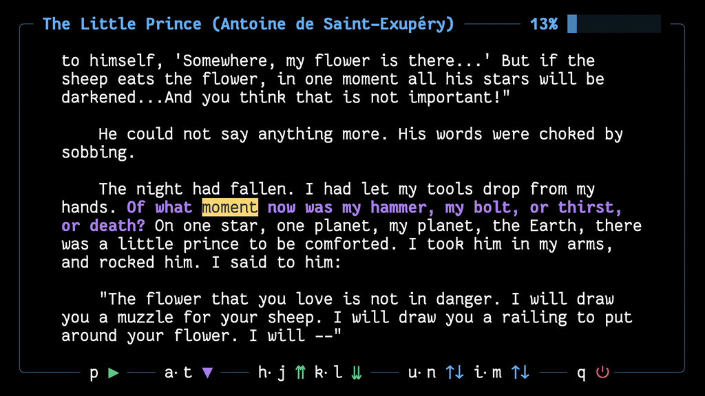

<div align="center">


### Yue - Terminal eBook Reader with Text-to-Speech



Yue is a versatile terminal eBook and document reader that is designed to seamlessly blend reading and listening. Built with multi-format support and modular multi-lingual text-to-speech integration, it provides synchronized word highlighting, smooth auto-scrolling, chapter navigation and persistent progress tracking to keep your reading workflow simple and streamlined.

</div>

---

## Features

| **Feature**                             | **Description**                                                                                |
| --------------------------------------- | ---------------------------------------------------------------------------------------------- |
| **Multi-Format Support**             | Support for EPUB, PDF, TXT, DOCX, HTML, RTF, and Markdown with seamless format detection  |
| **Modular TTS System**               | Edge TTS (default) and Kokoro TTS (local/offline) with extensible architecture for new models  |
| **Cross-Platform & Multilingual**    | Full support for macOS, Linux, Windows (via WSL) with 100+ languages and consistent global experience    |
| **Speed Adjustment**                 | Adjust text-to-speech playback speed from 1x to 3x for personalized listening experience       |
| **Auto-Scroll & Precise Word Highlighting**        | Automatic scrolling and word-level highlighting synchronized with actual speech, improving focus and concentration     |
| **Smart Persistence**                | Automatic progress saving, state restoration, and cross-session continuity for seamless reading|
| **Skip Front & Back Matter**      | Automatically skips the title page, copyright, TOC, index, about-the-author/publisher and similar, so reading starts at the real content (configurable) |
| **Save as Standard EPUB**      | Converts any single-file format (PDF, TXT, DOCX, HTML, RTF, MD) into a standard EPUB2 on request, for use in other readers |
| **Fast Navigation**                  | Intuitive shortcuts, mouse support, smooth scrolling and chapters list for fast navigation.     |
| **Extensive Customization**          | Fully customizable keyboard layouts (including Vim-style bindings), adjustable UI elements, colors, and display modes|
| **Interactive Start Menu**           | Launch with no arguments to browse recent books and your filesystem, and set the TTS model, voice, language and speed before reading |

---

## Quick Start (macOS and Linux)

> **Want to try Yue right away?** Follow these simple steps:

```bash
# 1. Install FFmpeg (required for audio processing)
# macOS
brew install ffmpeg
# Ubuntu/Debian  
sudo apt install ffmpeg

# 2. Install Yue from source
git clone https://github.com/simgsr/yue.git
cd yue
pip install .

# 3. Practice using Yue with the navigation guide
yue --guide

# 4. Start reading!
yue path/to/your/book.epub 
```

> **Note:** Yue is not on PyPI yet, so install from source for now. Quick start uses Edge TTS (requires internet). For offline capabilities, see [full installation](#-installation-macos-linux-and-windows).

---

## Installation (macOS, Linux and Windows)

### Prerequisites

#### Core Requirements
- **FFmpeg** - Audio processing (required)

#### Optional Dependencies  
- **espeak** - Kokoro TTS support

#### macOS (Homebrew)
```bash
brew install ffmpeg
# Optional
brew install espeak
```

#### Ubuntu/Debian
```bash
sudo apt update && sudo apt install ffmpeg
# Optional  
sudo apt install espeak
```

#### Windows
```bash
# 1. Install WSL
# Open PowerShell as Administrator:
wsl --install

# 2. Restart your PC if prompted, then launch Ubuntu from Start Menu

# 3. Inside Ubuntu terminal:
sudo apt update && sudo apt upgrade -y
sudo apt install ffmpeg python3 python3-pip -y
# Optional  
sudo apt install espeak
```

### Install Yue

#### Standard Installation

```bash
# 1. Clone repository
git clone https://github.com/simgsr/yue.git
cd yue

# 2. Install dependencies
pip install -r requirements.txt

# 3. Install Yue
pip install .
```

#### Enable Kokoro TTS (Optional)

For local/offline TTS capabilities:

```bash
# 1. Edit requirements.txt - uncomment Kokoro packages:
kokoro>=0.9.4
soundfile>=0.13.1
huggingface-hub>=0.34.4

# 2. Install PyTorch
# CPU version:
pip install torch torchvision torchaudio
# GPU version (CUDA):
pip install torch torchvision torchaudio --index-url https://download.pytorch.org/whl/cu121

# 3. Install updated requirements
pip install -r requirements.txt

# 4. Install Yue
pip install .
```

---

## Usage

### Basic Commands

```bash
# Start with default TTS
yue path/to/your/book.epub

# Launch without arguments to open the interactive start menu
yue

# Open the start menu explicitly (same as `yue ui`)
yue --menu
yue -i

# Practice Yue default keys with the navigation guide
yue --guide

# View available command line options
yue --help

# Use specific TTS model (edge/kokoro/none) 
yue --tts kokoro path/to/your/book.epub

# Use a specific voice (full list at VOICES.md)
yue --voice "en-US-AriaNeural" path/to/your/book.epub

# Set the speech speed (e.g., 1.5x)
yue --speed 1.5 path/to/your/book.epub

# Specify a language code if needed
yue --lang a path/to/your/book.epub

# Seconds of overlap between sentences
yue --over 0.2 path/to/your/book.epub

# Enable PDF cleaning filter (removes page numbers, headers and footnotes, default: 10% (0.1) from both bottom and top of the page)
yue --filter path/to/your/book.pdf

# Set custom PDF filter margins (0.0-1.0, where 0.1 = 10% of page)
yue --filter 0.15 path/to/your/book.pdf          # Both margins to 15%
yue --filter 0.12 0.20 path/to/your/book.pdf     # Header 12%, footnote 20%

# Use the Vim keyboard layout
yue --keys vim path/to/your/book.epub

# Start in a specific visual layout mode: 0=minimal, 1=medium, 2=full, 3=speed reading
yue --mode 0 path/to/your/book.epub
yue -m 1 path/to/your/book.epub
yue -m 2 path/to/your/book.epub
yue -m 3 path/to/your/book.epub

```

### Keyboard Controls (Default)

<div align="center">

| **Key Binding**                         | **Action Description**                                                                         |
| --------------------------------------- | ---------------------------------------------------------------------------------------------- |
| `q`                                     | Quit the application and save current reading progress automatically                           |
| `p`                                     | Pause or resume the text-to-speech audio playback                                              |
| `a`                                     | Toggle auto-scroll mode to automatically advance during TTS playback                           |
| `t`                                     | Select and highlight the top sentence of the current visible page                              |
| `h` / `l`                               | Move the reading line to the previous or next paragraph in the document                        |
| `j` / `k`                               | Move the reading line to the previous or next sentence in the document                         |
| `z` / `x`                               | Move the reading line to the previous or next chapter in the document                          |
| `c`                                     | Open the chapter index menu to browse and jump to any chapter                                  |
| `i` / `m`                               | Jump up or down by full pages for rapid navigation through longer documents                    |
| `u` / `n`                               | Scroll up or down by smaller increments for fine-grained position control                      |
| `y` / `b`                               | Jump directly to the beginning or end of the document for quick navigation                     |
| `r`                                     | Open the recent books menu to quickly switch between 5 last read books                       |
| `,` / `.`                               | Decrease or increase text-to-speech playback speed (1x to 3x)                                  |
| `s` / `w`                               | Toggle sentence highlighting or word highlighting on/off                                       |
| `v`                                     | Cycle through UI complexity modes (Minimal, Medium, Full)                                      |
| `o`                                     | Re-open the start menu to change book or TTS settings without quitting                         |

</div>

### Mouse Controls

- **Click** - Jump to sentence
- **Scroll** - Navigate content  
- **Progress bar click** - Jump to position

## Customize

### Start Menu

Running `yue` with no file argument opens an interactive start menu (`yue --menu`,
`yue -i` and `yue ui` do the same). From there you can:

- Pick a book from your recent books, or browse the filesystem to find one
- Choose the TTS model, voice, language and playback speed before reading starts
- Set a default folder to start browsing from, and a default language to filter
  the voice list — both are remembered between runs

The first `yue ui` run is guided: it asks for your books folder, then your
language. Press `o` while reading to re-open the menu without quitting.

Menu preferences are stored in `settings.json` alongside your reading progress
(see [Data Storage](#data-storage)).

### UI Modes

Yue offers four UI complexity modes that you can cycle through using the `v` key, set as your default in the [config.py](yue/config.py) file, or choose at launch with `-m` / `--mode`:

- **Mode 0 (Minimal)** - Clean text-only display with no borders or UI elements
- **Mode 1 (Medium)** - Displays a top title bar with progress information and borders
- **Mode 2 (Full)** - Full UI with both top title bar and bottom control information
- **Mode 3 (Speed Reading)** - Single-word speed-reading display

Additionally, Yue provides customizable word-level and sentence-level highlighting that can be adjusted to suit your reading preferences. You can cycle through different highlighting modes using the `w` and `s` keys. These highlighting settings can also be configured as defaults in the [config.py](yue/config.py) file.

### Keyboard Layouts

Yue comes with two built-in keyboard layouts that can be set using -k/--key command line option or set as your default in the [config.py](yue/config.py) file. You can create your own keyboard layout by copying and modifying one of the existing layout files:

- **Default Layout** - [keys_default.json](yue/keys_default.json) - Standard keyboard layout
- **Vim Layout** - [keys_vim.json](yue/keys_vim.json) - Vim-style keyboard layout
- **Custom Layout** - Customize your own navigation keys by creating your own keyboard layout json file. Each command can accept a single key (e.g., `"play_pause": "p"`) or multiple keys as an array (e.g., `"play_pause": ["p", " "]`).

### Color Themes

Yue allows you to customize the color theme, visual icons/symbols and all ui elements of the interface by modifying the classes in [ui.py](yue/ui.py). Create your own theme or choose one of the three themes that come with the default installation.

- **Default Theme** - The default colorful theme with various colors for different UI elements
- **Black Theme** - A dark monochrome theme that's suitable for bright backgrounds
- **White Theme** - A light monochrome theme that's suitable for dark backgrounds

### Skip Front & Back Matter

By default Yue skips the navigation and boilerplate sections of a book so reading starts at the actual content: the title page, copyright page, table of contents, dedication, index, about-the-author/publisher, credits, and similar. This is controlled by two settings in [config.py](yue/config.py):

- `SKIP_FRONT_MATTER` (default `True`) — drops front matter (title, copyright, TOC, dedication, ...).
- `SKIP_BACK_MATTER` (default `True`) — drops back matter (index, about the author, glossary, credits, ...).

For EPUBs these are detected per spine file (by filename and heading) and dropped whole. For single-file formats (PDF, TXT, DOCX, HTML, RTF, Markdown) a conservative paragraph-level pass is applied. Set either flag to `False` to keep that content in the book.

### Save as Standard EPUB

Yue can repackage any single-file format (PDF, TXT, DOCX, HTML, RTF, Markdown) into a standard EPUB2 file — useful for moving a book to other readers or devices. When you open one of these formats, Yue asks whether you'd like to save a standard EPUB (it writes to `<same-name>.epub` next to the source). If the file has no readable text (e.g. an image-based PDF), Yue tells you it couldn't convert it.

This is controlled by `OFFER_EPUB_CONVERSION` in [config.py](yue/config.py) (default `True`). The exported EPUB reflects the same settings you read with — for example, skipped front/back matter is left out. It is skipped automatically for the `--guide` file.

---

## Development

> **Interested in extending Yue?** 

Check out the [Developer Guide](DEVELOPER.md) for instructions on adding new TTS models and contributing to the project.

### Data Storage

**Reading Progress:**
- **macOS:** `~/Library/Application Support/yue/`
- **Linux:** `~/.local/share/yue/`  
- **Windows (WSL):** `~/.local/share/yue/` (within WSL filesystem)

**Error Logs:**
- **macOS:** `~/Library/Logs/yue/error.log`
- **Linux:** `~/.cache/yue/log/error.log`
- **Windows (WSL):** `~/.cache/yue/log/error.log` (within WSL filesystem)

---

## Credits

Yue is a modified version of [Lue](https://github.com/paulilaaso/lue) by the Lue
contributors, renamed and developed further in this fork. All credit for the
original reader belongs to that project.

---

## License

This project is licensed under the **GPL-3.0-or-later License** - see the [LICENSE](LICENSE) file for details.

As a modified version of Lue, this project is distributed under the same license
as the original, and these changes are released under GPL-3.0-or-later as well.

---

<div align="center">

<a title="This tool is Tool of The Week on Terminal Trove, The $HOME of all things in the terminal" href="https://terminaltrove.com/"></a>

</div>
